  

# A Data Engineer project.  

**What is Ford GoBike?**
Ford GoBike is the Bay Area's bike share system. Bay Area Bike Share was introduced in 2013 as a pilot program for the region, with 700 bikes and 70 stations across San Francisco and San Jose. Once expansion is complete, Ford GoBike will grow to 7,000 bikes across San Francisco, the East Bay and San Jose.  

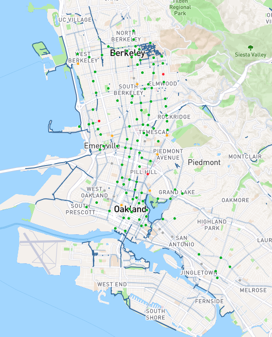

Ford GoBike, like other bike share systems, consists of a fleet of specially designed, sturdy and durable bikes that are locked into a network of docking stations throughout the city. The bikes can be unlocked from one station and returned to any other station in the system, making them ideal for one-way trips. People use bike share to commute to work or school, run errands, get to appointments or social engagements and more. It's a fun, convenient and affordable way to get around.

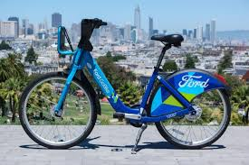

The bikes are available for use 24 hours/day, 7 days/week, 365 days/year and riders have access to all bikes in the network when they become a member or purchase a pass.

### Scope the Project and Gather Data  

The objective of optimizing the number of bicycles in each station and studying the behavior of the GoBike user.
After the exploratory analysis of the data, I have chosen to create a DataWarehouse in Redshift for storage and exploitation of the data using BI tools such as Quicksight or Tableau. The ETL will be developed with Airflow to automate the upload through task.
In principle, a large number of users is not expected for the exploitation of the data.

Steps:
1. Raw storage of files (in our case CSV) in AWS S3.
2. Exploratory analysis and data wrangling with Spark
3. Clustering and output of data in Parquet format
4. Definition of the data model
5. Create dimension tables and fact tables in Redshift
6. Development in Airflow of the necessary operators to load data in our Redshift model  

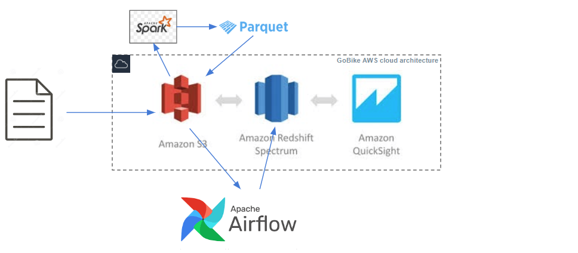

#### 1. Raw storage of files in AWS S3
En nuestro S3 tenemos una serie de csv con la información que generan las bicicletas compartidas GoBike.  
Total size: 558.4 MB in 16 objects.

#### 2. Exploratory analysis with PySpark
Mediante el Jupyter Noetbook **bikes_SparkSession.ipynb**, realizo las tareas necesarias para realizar el análisis exploratorio de los datos, la limpieza y desarrollo  del script para exportar a Parquet los resultados obtenidos.  
Despues de una primera lectura de todos los archivos CSV alojados en AWS S3, obtenemos un dataset con more than 2.7 million records in 16 columns and includes records from 2018-01-01 to 2019-09-30.  
**STAGING TRIPS**  
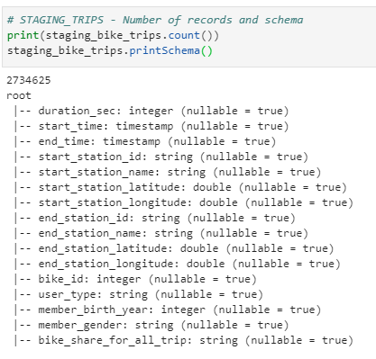  

Examinando el schema determino que la mejor arquitectura para la explotación de estos es desarrollar una BB.DD. en estrella con tablas de dimensiones y tablas de hechos. De este modo podremos dar respuesta a las siguientes cuestiones:  
* The times of the journeys
* From where and where with geolocation
* Age, gender and type of user  

In addition columns of year, week, month, day and hour have been added for a better subsequent analysis  

**Bike Trips star data model**  
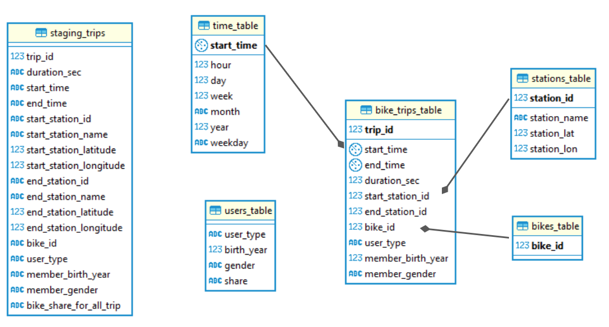  

**DIM TABLES**  
<table class="">
  <tr>
    <td>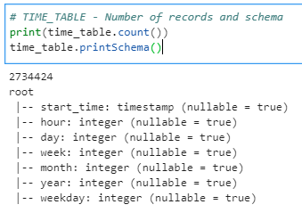</td>
    <td>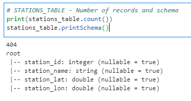</td>
  </tr>
  <tr>
    <td>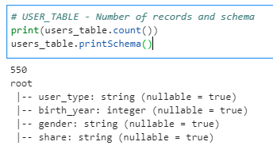</td>
    <td>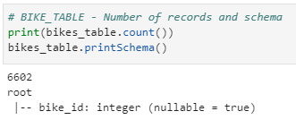</td>
  </tr>
</table>

**FACT TABLE**  
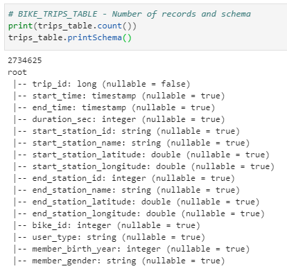

### Step 4: Run ETL to Model the Data  

* **StageToRedshiftOperator**
* **LoadDimensionOperator**
* **LoadFactOperator**
* **DataQualityOperator**  

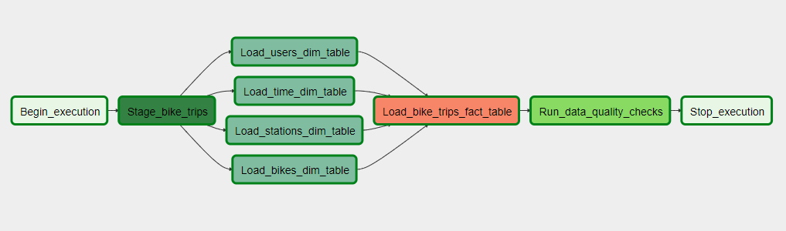

### Step 5: Complete Project Write Up  
**Tiempos de carga**  
Aquí Texto  
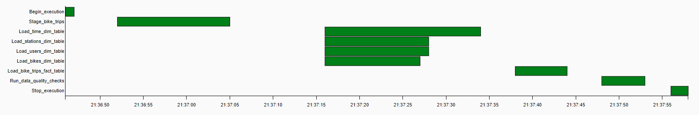  

**Todos los task OK!!**  
Aquí Texto  
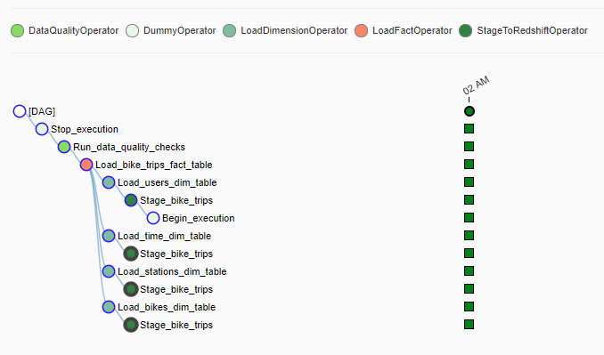  

### EXTRA BONUS  
**Quicksight dashboard**  
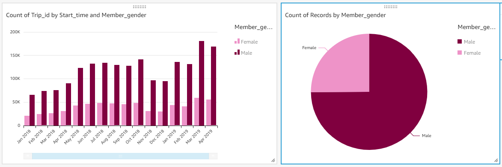 
